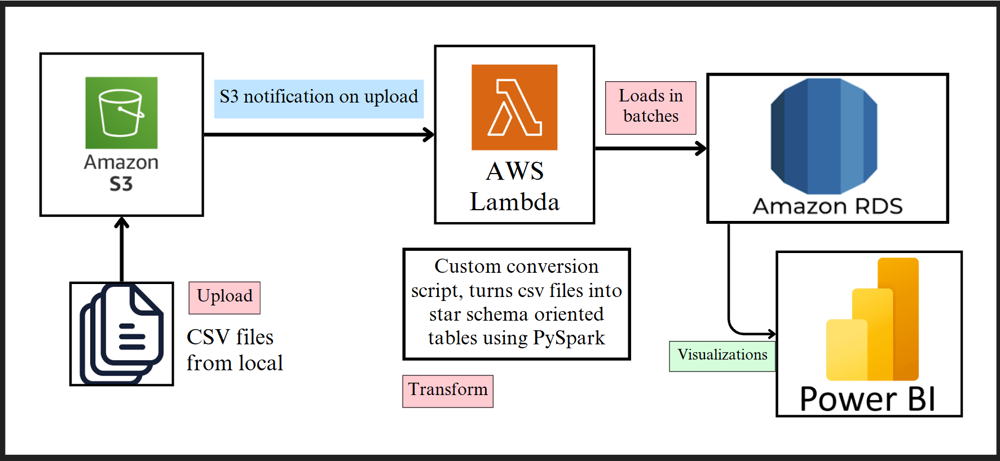
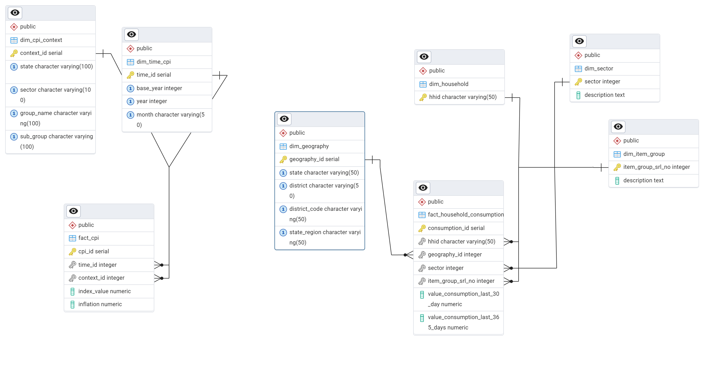
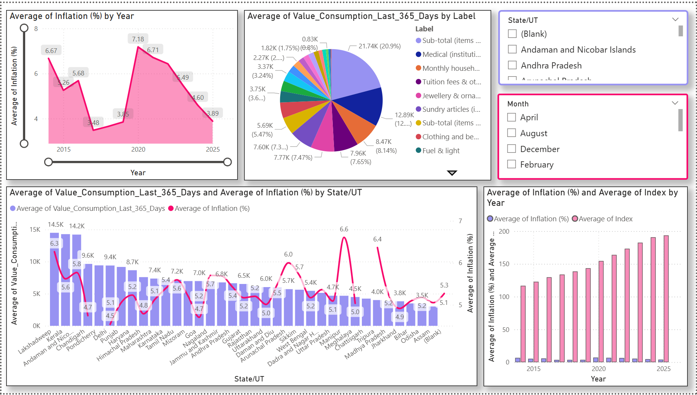

# GOIStats  
Deriving inferences from datasets sourced from the national data archive.  

## Current Datasets   

1. **Household Consumption Dataset**  
   - [Dataset Link](https://microdata.gov.in/nada43/index.php/catalog/CEXP)  
   - Can be accessed through [Nesstar Publisher](https://www.ihsn.org/software/ddi-metadata-editor)  

2. **Consumer Price Index and Inflation Data**  
   - [Dataset Link](https://esankhyiki.mospi.gov.in/macroindicators?product=cpi)  


Cleaned datasets cannot be made public due to license agreements.<br/><br/>
You can access the cleaning script from here: [](https://colab.research.google.com/drive/1K5T8ZZ_sY3dv31pMmmQPrZLA40inmn_P?usp=sharing)


### Pipeline overview:


### Our final database schema looks like this: 


#### In order to deploy on AWS: 
1. Create terraform.tfvars with appropriate access keys to your account(must have a proper IAM role)
2. First deploy GOIStats/bootstrap with the following commands: 
```bash
terraform init
```

If credentials problem comes up then configure your environment using: 
```bash
aws configure
```

Finally use: 
```bash
terraform plan
```
```bash
terraform apply -auto-approve
```
**Note: Additional charges may apply if large datasets are transferred within the vpc using lambda, we avoided using AWS Glue due to cost constraints.**

### PowerBI dashboard: 


